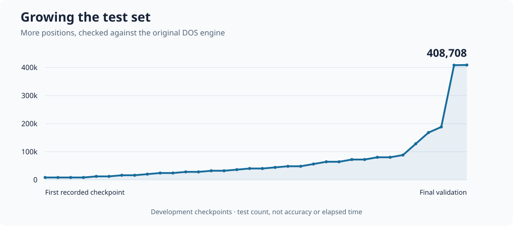

[简体中文版](/posts/rebuilding-a-dos-xiangqi-engine-zh/)

*Chinese Chess Master III: Jiangzu* (象棋大師 III／將族) was a popular DOS Xiangqi game. Its developer’s [historical company profile](https://games.sina.com.cn/zhuanqu/guangpu/intro.shtml) claims 200,000 copies sold. I played a number of games against it when I was yong and won most of them. I’m an [international Xiangqi grandmaster](https://xusheng.dev/posts/grandmaster/), so that wasn’t particularly surprising, but I still found it a worthwhile opponent.

My father is also a Xiangqi fan and used to play this game when he was younger. I found his disk and played it a little myself. It came out in **1992**, the same year I was born.



I liked the interface, especially the opponent-selection screen. It includes characters from the Chinese novel *Journey to the West* (西遊記), each with a portrait and a short description.



Eventually I wanted to do more than run it in DOS. Could I preserve the engine and play against it in a modern GUI?

**TL;DR:** With Codex’s help, I rewrote the engine in C, added UCI/UCCI support, and checked it against the original on **408,708 test cases**. [The code is on GitHub](https://github.com/xusheng6/cch-cms1).

## A little background

The game was developed by **Yu Hsi-Shun (虞希舜)** and **T-Time Technology (光譜資訊)**. It grew out of Yu’s earlier Xiangqi programming work and became a commercial DOS game with graphics, named opponents, and a challenge-based progression. [This historical account](https://read.99csw.com/book/579/18112.html) describes how the 1992 release built on the earlier program.

Its 36 opponents look like different personalities, but underneath they share the same engine. Seven use a fixed two-ply search—roughly a move and a reply, with extra tactical searching. The others get different game clocks, which determine how much thinking time the engine can spend. Bogey gets one minute, Hand eight, and Skeleton 47: whole-game allowances, not time per move.

So the characters mostly change the search budget, not the engine’s understanding of Xiangqi. Some even share identical settings.

## Rebuilding the engine

I used Codex to investigate the game and write a portable C version. We used [Binary Ninja](https://binary.ninja/) and disassembly to inspect the DOS code, then [DOSBox-X](https://dosbox-x.com/) to run the game and capture its initialized memory.



The engine lives in `CMS1.EXE`, a module loaded by the main game, `CCH.EXE`. It is a classical engine: it searches moves and replies using alpha-beta search, then evaluates positions with hand-written rules and tables.

Getting a working rewrite was only part of the job. It soon agreed with the original on many positions, but there were still plenty of disagreements. I wanted more than an engine that played reasonably well. I wanted this particular engine’s decisions.

That meant recovering the small details too: exact evaluation constants, move order, repetition handling, and special cases in the search.

The rewrite comes to about [**3,400 lines of C code**](https://github.com/xusheng6/cch-cms1/tree/main/port).

## Building a feedback loop

Rather than keep asking Codex to “make it more accurate,” I pushed for a repeatable test loop.

We built a harness using [Unicorn](https://www.unicorn-engine.org/) to run the original 16-bit engine code without clicking through the DOS interface. Then we could:

1. Generate a large batch of positions from legal move histories.
2. Run the original and the rewrite at the same search depth, with opening books disabled.
3. Compare their chosen moves and scores.
4. Investigate disagreements, fix the rewrite, and repeat with fresh positions.

This is how I think about **harness engineering** here: give the coding agent a way to run its work, measure the result, and get concrete feedback. The original program was our reference, so we did not have to trust that a plausible-looking translation was correct.

Some differences were tiny. In one case, both engines chose the same move, but one scored it 157 and the other 156. We traced that to the order in which they searched escape moves during a cannon check. Fixing the ordering resolved the discrepancy.

As the tests got faster, I kept asking for larger batches. When one batch matched, we generated another.

The chart shows the growing test corpus, not an accuracy percentage. The final rewrite matched the original’s move and score on **408,708 cases**, mostly at depths 2–4, with a smaller set of deeper searches. The last three fresh shallow batches had 20,000 cases each and found no differences.

That does not mean the algorithm is a perfect rewrite. Since [program equivalence is undecidable in general](https://arxiv.org/abs/2507.07480), the testing convergence gives me enough confidence to call the rewrite successful.

## How strong is it?

I also wanted a rough strength estimate. Full-strength [Pikafish](https://github.com/official-pikafish/Pikafish) would be far too strong, so we used a version with calibrated strength controls: `UCI_LimitStrength` enables reduced-strength play, and `UCI_Elo` sets the target rating.

Against Pikafish set to 1400, CCH won 13 games and lost 11. That gives a rough estimate of **1,429 on Pikafish’s engine-rating scale**. It is a small sample with wide uncertainty, not an official human Elo. These matches also preceded the final fidelity fixes.

We tested ElephantEye, another open-source Xiangqi engine. It is much weaker than full-strength Pikafish, but still comfortably stronger than CCH: it beat our experimental larger-cache CCH variant 8–0. The [validation notes](https://github.com/xusheng6/cch-cms1/blob/main/VALIDATION.md#strength-is-a-different-question) explain the limitations of these comparisons.

None of that takes away from what I like about the game. I wanted to bring back an opponent my father and I had played, not turn it into a modern champion.

The port now runs natively, speaks UCI and UCCI, and works in my Xiangqi GUI, Pikaboard. The [repository](https://github.com/xusheng6/cch-cms1) includes the engine and smoke tests, but not the original game binaries, opening book, or artwork. Recovered numeric tables are included; [NOTICE](https://github.com/xusheng6/cch-cms1/blob/main/NOTICE.md) explains their provenance and the license scope.

An engine born in the same year as me gets to keep playing.
